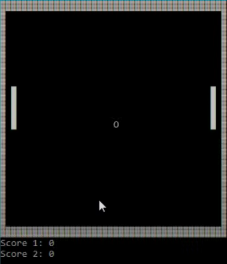

# Ping-Pong-Game
A classic fun Ping Pong Game implemented using basic fundamental principles of C++.

Concepts Used :
1) Object Oriented Programming
2) Concepts of classes in C++
3) Use of header files 
4) Use of Enumerated Data Types

